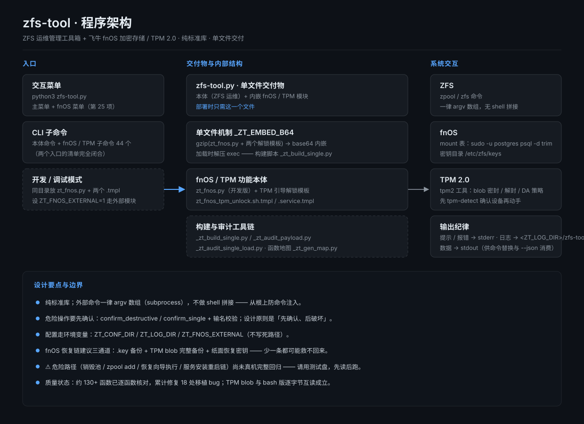
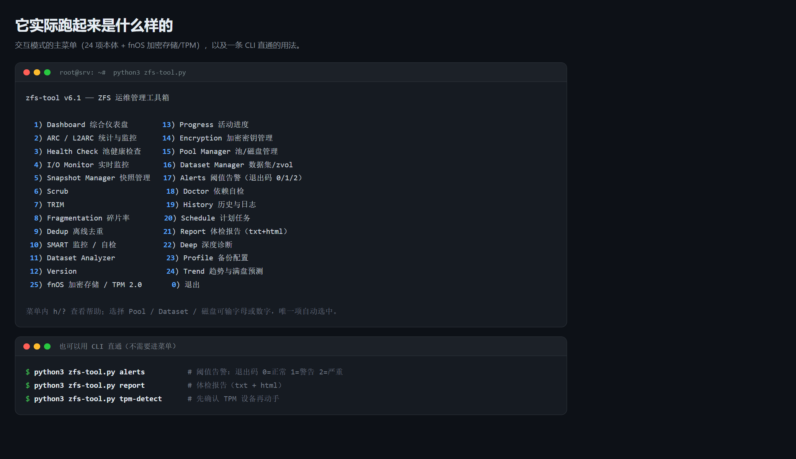

> **本工具由 DeepSeek（DSH agent）编写** · 仓库由 [CNyaotian](https://github.com/CNyaotian-Lunar) 维护与发布。

> ⚠️ 本仓**不含** fnOS 扩展模块 `zt_fnos.py`（它是飞牛论坛网友 **mspilot86** 两个 bash 脚本的移植版，原帖未声明许可协议，未随本仓分发）。缺少该模块时，fnOS 相关子命令会 fail-safe 退出，**不影响 ZFS 本体功能**。

# zfs-tool — ZFS 运维管理工具箱

> 主程序版本: **v6.2** · 语言: Python 3(纯标准库, ≥3.8) · 目标平台: TrueNAS SCALE / OpenZFS Linux / 飞牛 fnOS
> 作者: CNyaotian（本工具由 **DeepSeek / DSH agent** 编写）

---





## 1. 程序定位

`zfs-tool.py` 是 **ZFS 日常运维的一体化工具箱**（由旧版 `zfs-tool.sh` v4.0 重构而来，纯 Python 零依赖，单文件拷贝到机器上即可用）：

```
┌─ zfs-tool.py(v6.2) ───────────────────────────────┐
│  ZFS 运维管理工具箱(菜单 1–24)                      │
│    dashboard / ARC / SMART / 快照 / Pool 管理 /    │
│    告警 / 趋势预测 / 备份 Profile …                │
│  菜单 25 = fnOS 加密存储/TPM 桥接(本仓不含该模块)    │
└───────────────────────────────────────────────────┘
```

- **`zfs-tool.py`** — 单文件发行版，完整的 ZFS 工具箱。
- **fnOS 模块（`zt_fnos.py`）** — **不随本仓分发**：飞牛论坛网友 mspilot86 两个 bash 脚本的移植版，原帖未写许可协议。自行取得后，可用构建脚本注入单文件（见 §7）。
- 源 bash（第三方，未随本仓分发）与本仓 `zfs-tool.sh` 保留不动，作为行为对照基准。

---

## 2. 主菜单(交互模式 `python3 zfs-tool.py`)

| 键 | 功能 | 键 | 功能 |
|---|---|---|---|
| 1 | Dashboard 综合仪表盘(带告警摘要) | 13 | Progress 活动进度(scrub/resilver/trim) |
| 2 | ARC / L2ARC 统计与实时监控 | 14 | Encryption 加密密钥管理 |
| 3 | Health Check Pool 健康检查 | 15 | Pool Manager 池/磁盘管理 |
| 4 | I/O Monitor 实时监控 | 16 | Dataset Manager 数据集/zvol |
| 5 | Snapshot Manager 快照管理 | 17 | Alerts 阈值告警(退出码 0/1/2) |
| 6 | Scrub | 18 | Doctor 环境/依赖自检 |
| 7 | TRIM | 19 | History 历史与日志 |
| 8 | Fragmentation 碎片率/重写工具 | 20 | Schedule 计划任务 |
| 9 | Dedup 离线去重(zfs-dedup) | 21 | Report 体检报告(txt+html) |
| 10 | SMART 监控/自检 | 22 | Deep 深度诊断 |
| 11 | Dataset Analyzer | 23 | Profile 备份配置 |
| 12 | Version | 24 | Trend 趋势与满盘预测 |
| — | (25 = fnOS 加密存储/TPM, 本仓不含该模块) | 0 | 退出 |

菜单内 `h`/`?` 查看帮助; 选择 Pool/Dataset/磁盘可输字母或数字, 唯一项自动选中。

## 3. CLI 命令

```
基础:      dashboard  arc  health  iostat  frag  rewrite <路径> [-r|-P|-v]
           quiesce on|off|status|check(暂停/恢复相册·影视·应用·docker)  dedup  version
           lat(延迟归因 -q/-r/--hist)  brt(块引用)  cache-status(缓存状态)
快照/备份: snapshot  snapdiff  rollback(双重确认)  backup(zfs send/recv 向导)
           send-file(快照→.zfs 冷备)  recv-file  prune(保留最近 N 份)
           resume(中断接收续传, --show-token)
运维:      scrub  trim  smart  encrypt  poolmgr  dsmgr  dataset  progress
           doctor  hist  help|usage(用法)
Pool 管理: pool-destroy(双重确认+输名校验)  l2arc-add  slog-add  checkpoint(池检查点)
           l2arc-mode(secondarycache=all|metadata|none)
告警/报告: alerts(退出码 0/1/2, --json)  schedule(crontab/systemd)
           report(体检报告)  deep(深度诊断)  notify-test(SMTP 测试)
备份配置:  profile(菜单)  profile-run <name>  backup-all
趋势:      trend(满盘预测)  trend-collect(每日采集)  smart-trend(SMART 属性预警)
cron 用:   scrub-run <pool>  snap-auto <ds> [keep] [label]  status [--json]
通用选项:  -p/--pool P   -d/--dataset D   --json   --dry-run|-n   --yes|-y
```

使用:
```bash
sudo python3 zfs-tool.py dashboard --json
sudo python3 zfs-tool.py health
sudo python3 zfs-tool.py alerts; echo $?        # 0=正常 1=WARN 2=CRIT
sudo python3 zfs-tool.py poolmgr                # 删池/加 L2ARC/SLOG 菜单
sudo python3 zfs-tool.py trend                  # 容量趋势与满盘日期预测
sudo python3 zfs-tool.py snap-auto data 7 daily
sudo python3 zfs-tool.py status --json          # 供脚本消费的汇总
```

## 4. 特色能力

- **Alerts 阈值告警**: 多级健康检查, `alerts` 退出码 0/1/2 可直接用于 cron/监控; 支持 SMTP 邮件通知(去重+冷却), 配置文件 `zfs-tool.conf`(`ZT_CONF_DIR`, 默认 `/etc/zfs-tool` 回退 `~/.config/zfs-tool`)
- **Trend 趋势预测**: 容量样本落盘为 CSV(`<CONF_DIR>/data/trend.csv`), 预测满盘日期; `smart-trend` 跟踪 SMART 关键属性劣化
- **Profile 备份**: 具名备份配置, 传输限速(`pv`)/断点续传(`-s`)/发送后校验/`backup-all` 批量
- **Pool Manager**: 删除池(双重确认 + 输入池名校验)、添加 L2ARC/SLOG、L2ARC 缓存策略
- **Schedule**: 生成并安装 crontab / systemd timer(含模板预览 `cmd_systemd_preview`)
- **Doctor/Deep/Report**: 依赖自检、ZIL/ARC/扩展性深度诊断、体检报告导出 txt+html
- **quiesce**: 维护模式, 暂停相册/影视/应用/docker 等业务容器再操作存储
- **破坏性操作保护**: 删除/覆盖类命令双重确认、输名校验, 关键命令支持 `--dry-run` 预览

---

## 5. 部署

```bash
# 单文件模式: 只需 zfs-tool.py
sudo python3 zfs-tool.py

# fnOS 扩展模块(可选, 需自备 zt_fnos.py):
#   方式一: 同目录放 zt_fnos.py + 解锁模板, 设 ZT_FNOS_EXTERNAL=1 直接加载
#   方式二: 用 _zt_build_single.py 把模块注入单文件（见 §7）
```

## 6. 架构与设计要点

- 纯标准库; 外部命令一律 argv 数组(`subprocess`), 无 shell 拼接防注入
- 输出纪律: 数据/`--json` → stdout(供命令替换消费); 提示与报错 → stderr; 运行日志追加到 `<ZT_LOG_DIR>/zfs-tool.log`, 超过 `log_max` 轮转为 `.old`
- 危险操作: `confirm_destructive`/`confirm_single` 双重确认 + 先确认后破坏、输名校验等
- 单文件机制: 构建脚本 `_zt_build_single.py` 把 `zt_fnos.py`(及解锁模板) 压成 gzip+base64 写入 `_ZT_EMBED_B64`, 运行时解压 exec。**本仓该常量为空** —— 需要 fnOS 功能的用户自备模块后重新构建
- 配置: 环境变量 `ZT_CONF_DIR`(默认 `/etc/zfs-tool`, 无 `/etc` 时回退 `~/.config/zfs-tool`)/`ZT_LOG_DIR`(默认 `/var/log/zfs-tools`)/`ZT_FNOS_EXTERNAL`

## 7. 文件组成

| 文件 | 角色 |
|---|---|
| `src/zfs-tool.py` | 主工具单文件发行版(v6.2 工具箱), 交付物 |
| `src/zfs-tool.sh` | 早期 bash 版(行为基准, 保留) |
| `src/_zt_build_single.py` | 构建脚本: 把自备的 `zt_fnos.py`(+模板) 注入单文件 |
| `src/_zt_audit_payload.py` | payload 审计(开发版与注入版差异比对) |
| `src/_zt_audit_single_load.py` | 单文件加载链路实测 |
| `src/README_zfs-tool.md` | `src/` 目录速览(文件角色表) |
| `docs/` | 架构图 `architecture.svg` / 终端实物图 `terminal.png` |
| `logo/` | 图标与预览素材 |

## 8. 使用注意 / 已知边界

- 多数命令需要 **root**
- **危险路径未全部真机回归**（销毁池 / `zpool add` / 服务安装重启链）：请在测试盘上先读后跑
- fnOS 模块（不随本仓分发）的密钥与 TPM 操作涉及**不可逆**风险, 自行取得后请先读其自带说明

## 运行环境 / Requirements

- **Linux + Python 3** —— 本机在 **Python 3.12** 上做过 `py_compile` 与子命令实测（`version` / `doctor` 等 exit 0）。
- **外部命令**：`zpool` / `zfs` 为必需；`smartctl`、`mpstat`、`top`、`ssh`、`pv`、`zfs-dedup` 为可选（`Doctor` 会逐项检查 `CORE_BINS` / `OPT_BINS`）。
- **权限**：绝大多数功能需要 **root**（或等价的 ZFS 委派权限）—— 它会读写池、建/删快照、跑 scrub。
- **运行依赖：无**（只用 Python 标准库）。
- ⚠️ **本仓不含 fnOS 扩展模块 `zt_fnos.py`**，因此 fnOS 相关子命令在本仓运行时不可用（见文件头与 README 顶部说明）。

**English:**
- **Linux + Python 3** — `py_compile` and subcommand smoke tests (`version` / `doctor`, exit 0) were run on **Python 3.12** here.
- **External commands**: `zpool` / `zfs` are required; `smartctl`, `mpstat`, `top`, `ssh`, `pv`, `zfs-dedup` are optional (the `Doctor` menu checks `CORE_BINS` / `OPT_BINS` item by item).
- **Privileges**: most features need **root** (or equivalent delegated ZFS rights) — it reads and writes pools, creates/deletes snapshots and runs scrubs.
- **Runtime dependencies: none** (Python standard library only).
- ⚠️ **This repo does not ship the fnOS extension module `zt_fnos.py`**, so the fnOS-specific subcommands are unavailable here (see the file header and the note at the top of this README).

## 权限与依赖 / Permissions & Dependencies

**文件 / Files**
- 读写配置目录 `ZT_CONF_DIR`（默认 `/etc/zfs-tool`；无 `/etc` 时回退 `~/.config/zfs-tool`）及其下 `data/`（趋势样本 CSV、SMART 趋势 CSV、crontab 备份、quiesce 状态 JSON、备份 Profile）。
- 读写日志目录 `ZT_LOG_DIR`（默认 `/var/log/zfs-tools`）。
- 读写 `/proc/<pid>/fdinfo`（`quiesce` 维护模式据此找出持有卷内写句柄的进程）；读写当前用户 crontab 与 `/etc/cron.d`（`hist` / `schedule`）。
- 数据集/快照等文件路径**以命令行给出的参数为准**（`send-file` / `recv-file` / `rewrite` 等不会自行改变目标）。
- 构建脚本 `_zt_build_single.py` 以**脚本自身所在目录**为基准读写 `zt_fnos.py` 与 `zfs-tool.py`，不写死任何机器路径。

**网络 / Network**
- 默认**不出网**：仅当 `zfs-tool.conf` 的 `[smtp]` 段配置了 `host`/`from`/`to` 时，`alerts` 与 `notify-test` 才连接该 SMTP 服务器（默认端口 587，`tls` 默认 true）。
- 备份/传输类命令可使用 `ssh` 直连远端主机，但仅在你显式给出该主机参数时才发起连接。
- 除上述两项外，就源码扫描而言**未发现**其它出网路径；**未发现**遥测或上报逻辑。

**命令与权限 / Commands & Privileges**
- 调用外部命令（一律 argv 数组、不经 shell 拼接）：`zpool`、`zfs`、`smartctl`、`systemctl`、`crontab`、`lsblk`、`mpstat`、`top`、`ssh`、`pv`、`zfs-dedup`（后 5 个为可选项，缺失时相关功能报错或降级）。
- **多数功能需要 root**：ZFS 管理操作、写 `/etc/zfs-tool` 与 `/var/log/zfs-tools`、安装 systemd 单元、写当前用户 crontab。非 root 运行时部分命令会失败并以非零码退出。

**凭据 / Credentials**
- SMTP 的 `user`/`password` 从 `zfs-tool.conf` 的 `[smtp]` 段读取（只读：不写回、不上传、不写日志）。
- `resume` 读到的 `receive_resume_token` 属敏感值：仅在内存中持有，默认只显示前 16 位（`--show-token` 才全显），**不写入日志或 JSON**，错误文本中的 token 会被擦除。

**生命周期脚本 / Lifecycle scripts**
- 无。本工具不安装开机或常驻服务，也不自行创建后台进程。
- ⚠️ 例外：`schedule` 会**按你的显式指令**读写当前用户 crontab 或安装 systemd timer/单元文件（写回前先备份 crontab）；fnOS 模块的 `autounlock` 可安装 systemd 解锁服务。这些只在你主动执行时发生。

**已知风险 / Known risks**
- 这是**面向真实 ZFS 池的运维工具**，具备真实破坏力：删除池（`pool-destroy`）、按保留策略清理快照（`prune`）、回滚（`rollback`）、`zfs send | zfs receive` 覆盖目标数据集、暂停/恢复业务服务（`quiesce`）、调整配额、`zpool add` 等。
- 多数破坏性命令带双重确认与输名校验，并支持 `--dry-run` 预览；`--dry-run` 采用**白名单 fail-closed**：不在白名单内的命令一律拒绝执行（避免"以为在预览、其实真跑了"）。
- 危险路径（销毁池 / `zpool add` / 服务安装重启链）**未做完整回归**：请在测试盘上先读后跑，并确保有可用备份。

**Files.** Reads and writes the config directory (`ZT_CONF_DIR`, default `/etc/zfs-tool`, falling back to `~/.config/zfs-tool`) and its `data/` subdirectory (trend CSVs, crontab backups, quiesce state JSON, backup profiles), plus the log directory (`ZT_LOG_DIR`, default `/var/log/zfs-tools`). It also reads `/proc/<pid>/fdinfo` (the `quiesce` maintenance mode looks for processes holding write handles on volume paths) and reads the current user's crontab plus `/etc/cron.d` (`hist` / `schedule`). Dataset and snapshot paths are taken from the command line. The build script resolves paths relative to its own directory; no machine-specific path is hard-coded.

**Network.** No network access by default. Only when the `[smtp]` section of `zfs-tool.conf` defines `host`/`from`/`to` do `alerts` and `notify-test` contact that SMTP server (port 587, `tls` on by default). Backup commands can `ssh` to a remote host, but only when you pass that host explicitly. Beyond those two, no other outbound path was found by source inspection; no telemetry or reporting logic was found.

**Commands & privileges.** External commands are invoked as argv arrays (never through a shell): `zpool`, `zfs`, `smartctl`, `systemctl`, `crontab`, `lsblk`, `mpstat`, `top`, `ssh`, `pv`, `zfs-dedup` (the last five are optional; affected features error out or degrade when missing). Most features require root: ZFS administration, writing `/etc/zfs-tool` and `/var/log/zfs-tools`, installing systemd units, and writing the user crontab.

**Credentials.** The SMTP `user`/`password` are read from the `[smtp]` section of `zfs-tool.conf` (read-only: never written back, uploaded, or logged). The `receive_resume_token` read by `resume` is sensitive: held in memory only, masked to its first 16 characters by default (`--show-token` reveals it), never written to logs or JSON, and scrubbed from error text.

**Lifecycle scripts.** None. The tool installs no boot-time or long-running service and starts no background process of its own. One exception: `schedule` writes the current user's crontab or installs systemd timer/unit files, only on your explicit request (it backs up the crontab first); the fnOS module's `autounlock` can install a systemd unlock service.

**Known risks.** This is an operations tool for real ZFS pools and it can destroy data: pool destruction (`pool-destroy`), snapshot pruning (`prune`), rollback (`rollback`), `zfs send | zfs receive` overwriting the target dataset, pausing/resuming business services (`quiesce`), quota changes, `zpool add`, and more. Most destructive commands use double confirmation and name verification and support `--dry-run`; the `--dry-run` check is a fail-closed whitelist, so commands outside the whitelist are refused instead of run. Dangerous paths (pool destroy, `zpool add`, service install/restart chains) have not been fully regression-tested: read first, run on a test disk, and keep a working backup.

---

## 附录 A: 创建不加密数据池(日常数据盘, fnOS)

> 以下为**手动原生 zpool** 做法（需人工补注册），适合批量/非向导场景 ——
> 全程只用 `zpool` 与 `psql` 原生命令，**不依赖本仓之外的任何模块**。
> ⚠ 命令会**擦除目标盘全部数据**，执行前务必确认盘符与盘中无数据！

```bash
# ── 0) 前提 ─────────────────────────────────────────────
#    * 新插入/确认可销毁的空盘, 如 /dev/sdX(以实际盘符为准, 可用 lsblk 确认)
#    * 想挂成第 N 个卷, 即 /volN(N = 现有 mount 表最大 id + 1)

# ── 1) 建池(不加密) ─────────────────────────────────────
# fnOS 风格基础参数, 但【不指定】encryption/keyformat/keylocation
sudo zpool create -f \
     -o ashift=12 -o failmode=continue -o autoexpand=on -o autoreplace=on \
     -O compression=lz4 -O atime=off -O xattr=sa -O acltype=posix \
     -O dnodesize=legacy -O normalization=none -O relatime=on \
     -O mountpoint=/volN trim_<uuid> /dev/sdX

# 例: 单盘 → zpool create -f -o ashift=12 ... -O mountpoint=/vol3 trim_pool3 /dev/sde
# 例: 镜像 → 把 /dev/sdX 换成 mirror /dev/sdX /dev/sdY
# 例: raidz1 → raidz1 /dev/sdX /dev/sdY /dev/sdZ
# (uuid 可手动给个不冲突名, 建议 trim_<uuidgen>, 仅字母数字与 - _)

# ── 2) FNOS 用户目录(WebUI 需要) ────────────────────────
sudo mkdir -p /volN/1000/thumb/1000
sudo chown -R 1000:root /volN/1000
sudo chmod 771 /volN/1000  /volN/1000/thumb
sudo chmod 771 /volN/1000/thumb/1000 2>/dev/null || true

# ── 3) 注册到 FNOS mount 表(trim 库) ─────────────────────
# 字段参考 public.mount(id, uuid, pool_type=2 ZFS, state_normal=0, stripe_cache_size=4096,
#                      warn_frsize=10, mount_base=/vol 或直接 mountpoint)
# 先查现有结构再插(避免字段不符):
sudo -u postgres psql -d trim -c "SELECT id,uuid,pool_type,mountpoint FROM public.mount ORDER BY id;"
# 然后仿照现有行 INSERT 一条 id=下一个可用

# ── 4) 验证 ─────────────────────────────────────────────
sudo zpool list -v
mount | grep /volN
sudo -u postgres psql -d trim -c "SELECT id,uuid,mountpoint FROM public.mount ORDER BY id;"
# FNOS WebUI → 存储 应能看到 /volN(可能需要刷新/重启 trim 服务)

# ── 回滚(如失败) ────────────────────────────────────────
# sudo zpool destroy trim_<uuid>   # 销毁刚建的池(会再次擦盘)
# sudo -u postgres psql -d trim -c "DELETE FROM public.mount WHERE uuid='trim_<uuid>';"
```

> 提示: 不加密池的 mountpoint 建议先设好 `/volN` 再注册，避免 WebUI 挂载语义混乱。
> 更省心路线: 若 FNOS WebUI 自带「新建存储」且接受非加密选项，优先用官方界面（自动处理注册/目录）。
